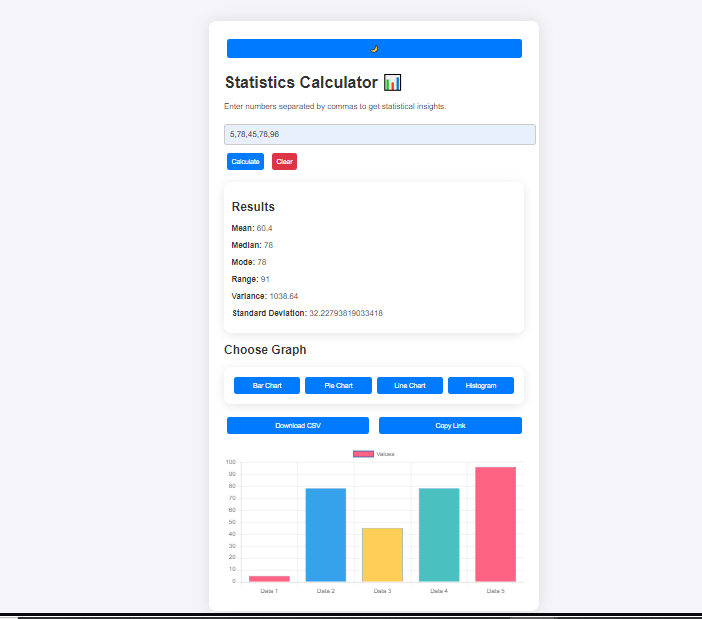

# Advanced Statistics Calculator 📊


## Demo:


An enhancement to the FreeCodeCamp statistics calculator tutorial, this project takes basic functionality to the next level by introducing modern UI/UX design, dynamic charts, dark/light mode toggle, interactive animations, and data export options. It’s designed not only to be a functional tool but also a visually engaging and user-friendly experience that sets a new standard for statistics calculators.

## Table of Contents

- [Project Overview](#project-overview)
- [Features](#features)
- [Technologies Used](#technologies-used)
- [How to Use](#how-to-use)
- [Getting Started](#getting-started)
- [Future Improvements](#future-improvements)

---

## Project Overview

This project builds upon the basic statistics calculator tutorial provided by FreeCodeCamp by adding new functionalities and a sophisticated user interface. It’s a perfect blend of educational purpose and professional-level design, making it ideal for anyone interested in learning both statistics and front-end web development.

The project aims to help users quickly calculate key statistical metrics such as mean, median, mode, range, variance, and standard deviation, while also providing the ability to visualize the data with various charts (bar, pie, line, histogram). In addition, it allows users to download the data or share a link to the results, making it an interactive and engaging experience.

### Key Features

- **Interactive Data Visualization**: Users can view their data in a variety of chart types including Bar, Pie, Line, and Histogram. 
- **Statistical Calculations**: Provides essential statistics such as Mean, Median, Mode, Range, Variance, and Standard Deviation.
- **Dark/Light Mode Toggle**: Seamlessly switch between a dark and light theme, making it suitable for different environments and user preferences.
- **Data Export Options**: Download the statistics as a CSV file or copy the result link for easy sharing.
- **Smooth Animations & UI/UX**: Incorporates smooth transitions, hover effects, neumorphism, and glassmorphism to deliver a modern and engaging experience.
- **Responsive Design**: Fully responsive and optimized for both desktop and mobile devices, ensuring a seamless experience on any screen size.

---

## Technologies Used

- **HTML5**: The structure of the web page, providing a semantic layout.
- **CSS3**: Styling for both the light and dark themes, animations, and modern UI elements like neumorphism and glassmorphism.
- **JavaScript**: Handles the core functionality, including the statistics calculations, chart generation, and interactivity.
- **Chart.js**: A popular charting library used to generate various types of graphs based on user input.
- **LocalStorage**: For saving theme preferences and ensuring that the selected theme persists across page reloads.
- **CSS Animations**: For smooth transitions and hover effects that enhance user interactivity.

---

## How to Use

1. **Enter Data**: Simply enter a series of numbers separated by commas (e.g., `10, 20, 30, 40, 50`) in the input field.
2. **Calculate Statistics**: Click the "Calculate" button to instantly view the statistical results, including Mean, Median, Mode, Range, Variance, and Standard Deviation.
3. **Choose a Graph**: Click on the desired chart type (Bar, Pie, Line, Histogram) to visualize your data in a graph.
4. **Export Data**: You can download the results as a CSV file or copy the link to share your results with others.
5. **Toggle Theme**: Use the theme toggle button to switch between dark and light mode based on your preference.

---

## Future Improvements
1. **AI-Powered Insights:** Add features to analyze the data and suggest meaningful insights or trends based on the numbers entered.
2.**Data Filtering:** Implement the ability to filter out certain values from the dataset (e.g., remove outliers).
3.**User Profiles:** Allow users to save their data and revisit their past calculations with a user authentication system.
4.**Mobile App Version:** Create a mobile app version of the calculator for easier access on-the-go.
5.**Advanced Statistical Methods:** Integrate more complex statistical analyses, such as regression models, to further enhance the tool's capabilities.

---

## Getting Started

### Prerequisites

- No special prerequisites are required, just a modern web browser.

### Installation

Clone the repository to your local machine or use it directly via a live demo:

```bash
git clone https://github.com/MduduziNdlovu-dev/Stats-calc.git
cd statistics-calculator
